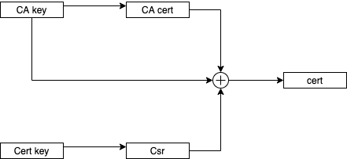

# Create TLS certificate



## Certification Authority

### Create key and certificate

``` bash 
DST=./data/certs
mkdir ${DEST}
openssl genrsa -des3 -out ${DST}/myCA.key 2048
openssl req -x509 -new -nodes -key ${DST}/myCA.key -sha256 -days 1825 -out ${DST}/myCA.pem
```

### Create Certificate for application

Create a private key:
```
openssl genrsa -out ${DST}/dev.test.com.key 2048
```

Then we create a CSR
```
openssl req -new -key ${DST}/dev.test.com.key -out ${DST}/dev.test.com.csr 
```
when asked about of Common Name (e.g. server FQDN or YOUR name) []test.com

Create the file dev.test.com.ext
```
authorityKeyIdentifier=keyid,issuer
basicConstraints=CA:FALSE
keyUsage = digitalSignature, nonRepudiation, keyEncipherment, dataEncipherment
subjectAltName = @alt_names

[alt_names]
DNS.1 = *.test.com
Create certificate
```
```
openssl x509 -req -in ${DST}/dev.test.com.csr -CA ${DST}/myCA.pem -CAkey ${DST}/myCA.key -CAcreateserial -out ${DST}/dev.test.com.crt -days 1825 -sha256 -extfile dev.test.com.ext 
```

### Export the certification authority for Mac

```
openssl pkcs12 -export -out ${DST}/certificate.pfx -inkey ${DST}/myCA.key  -in ${DST}/myCA.pem
```

 
## Test nginx Server
```
cd nginx
docker-compose up --build --force-recreate
````

## Test tomcat Server
```
cd tomcat-catalina
docker-compose up --build --force-recreate
````
